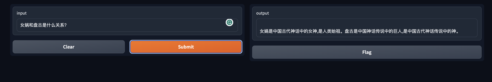
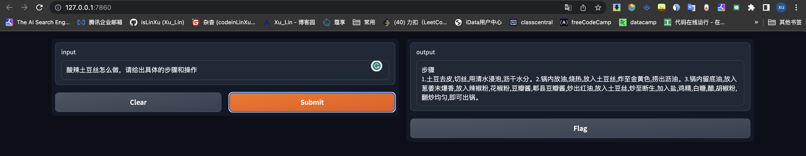
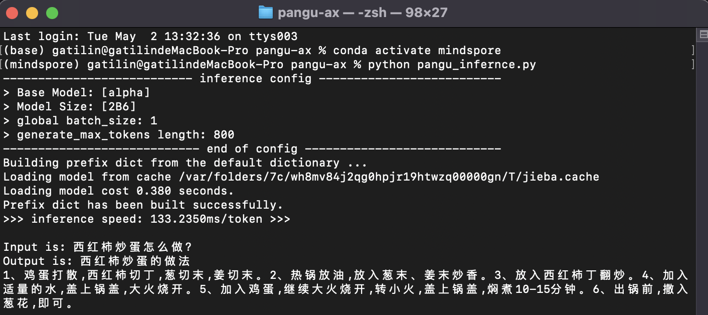
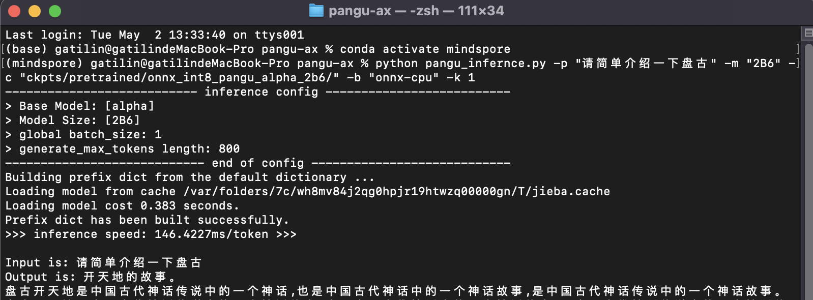

# pangu-ax


   
 [](https://github.com/isLinXu/pangu-ax)    

---

## 介绍

### 项目介绍

### 效果展示






## 使用说明


### 环境配置


### ckpts

```
sudo ln -s /Users/gatilin/Pan/ckpts/ ckpts/pretrained
```

### 运行

#### pcl-pangu sdk推理

```shell
python pangu_infernce.py
```



```shell
python pangu_infernce.py -p "请简单介绍一下盘古" -m "2B6" -c "ckpts/pretrained/onnx_int8_pangu_alpha_2b6/" -b "onnx-cpu" -k 1 
```



#### gradio web启动

#### 文本推理

```shell
python web/run_gradio_web.py
```


#### chatbot对话机器人

```shell
python web/run_pangu_bot.py
```


### 测试数据


## 参考


