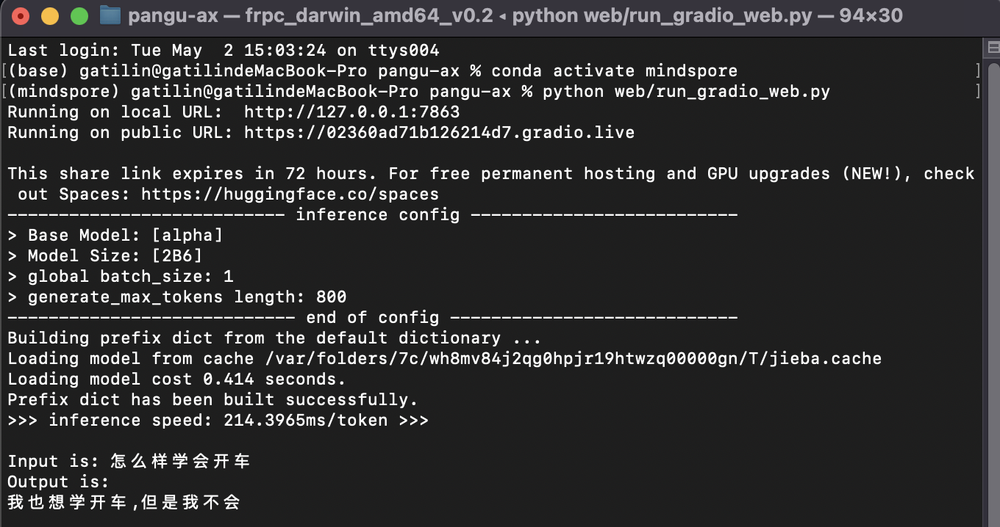

# pangu-ax


   
 [](https://github.com/isLinXu/pangu-ax)    

---

## 介绍

### 项目介绍

pangu-ax是专门针对盘古模型的相关工具。
支持盘古alpha模型的微调、推理、量化、web服务等操作。

---

“鹏程·盘古α“由以鹏城实验室为首的技术团队联合攻关，首次基于“鹏城云脑Ⅱ”和国产MindSpore框架的自动混合并行模式实现在2048卡算力集群上的大规模分布式训练，训练出业界首个2000亿参数以中文为核心的预训练生成语言模型。鹏程·盘古α预训练模型支持丰富的场景应用，在知识问答、知识检索、知识推理、阅读理解等文本生成领域表现突出，具备很强的小样本学习能力。

盘古训练代码、模型、部分数据、在线功能体验、模型压缩及跨平台微调推理已同步在OpenI 启智社区全部开源开放。

- 鹏程·盘古α-源代码仓库：https://git.openi.org.cn/PCL-Platform.Intelligence/PanGu-Alpha

鹏程·盘古α具有以下特点：

- 业界首个2000亿参数中文自回归语言模型
- 代码、模型逐步全开源
- 首创顺序自回归预训练语言模型ALM
- MindSpore超大规模自动并行技术
- 模型基于国产全栈式软硬件协同生态(MindSpore+CANN+昇腾910+ModelArts）


上图为鹏程·盘古α模型的网络结构，该模型是基于单向的Transformer decoder发展而来。query层堆叠在transformer层之上。query层的基本结构与transformer层相似，只是引入了一个额外的Query layer，来预测生成下一个query Q的位置。


### 效果展示


## news

- [x] 2023.05.01 完成cpu上的推理以及gradio web服务
- [ ] 
- [ ] ...


## 使用说明

### 环境配置

```
conda create -n mindspore python=3.8
```

```shell
conda activate mindspore
```

```shell
 pip install -r requirements.txt
```

### ckpts配置

ModelZOO权重文件下载：

| 启智社区                                                     | 百度云盘                                                     |
| ------------------------------------------------------------ | ------------------------------------------------------------ |
| [modelzoo](https://openi.pcl.ac.cn/PCL-Platform.Intelligence/pcl_pangu/src/branch/master/docs/README_MODELS.md) | [ckpts](https://pan.baidu.com/s/1UaMUf-djmk-KoPd273LE8A?pwd=u9u3) |
|                                                              |                                                              |

下面可以通过软链接的形式，将下载好的权重文件与默认路径对应上

```
sudo ln -s your/download/ckpts ckpts/pretrained
```

如果不使用软链接也可以，直接去对应文件下修改权重文件路径即可；


### 模型推理

CPU 推理加速主要采用了 Int8 量化和 layer_past 模型加速技术。已经支持 PanGu-Alpha 2.6B、13B 模型以及
PanGu-Alpha-Evolution 2.6B 模型。开箱即用，并提供量化接口，可以快速量化模型。

要点：

- CPU 推理速度接近 GPU V100 的推理速度
- CPU 推理资源需求低，2.6B 模型只需要 5G 内存，普通个人电脑都可以轻松部署
- 基于 Int8 量化技术，提升推理速度
- 基于 layer_past 模型推理加速技术，大幅度减少计算量，提升推理速度

#### 推理速度对比

| model | a100 | v100 (s/token) | Tesla T4 (s/token) | cpu/int8 (s/token) |
| ----- | ---- | -------------- | ------------------ | ------------------ |
| 2.6B  | 0.06 | 0.17           | 0.37               | 0.2~0.27 +         |
| 13B   | 0.22 | 0.70           | OOM                | 0.81~1 +           |

#### cpu 推理资源需求

- 线程数：2
- 内存占用：2.6B模型内存占用 5GB；13B模型内存占用 21GB。 资源占用低，普通个人电脑都可以体验2.6B模型。

#### pcl-pangu sdk推理


```shell
python pangu_infernce.py
```


```shell
python pangu_infernce.py -p "请简单介绍一下盘古" -m "2B6" -c "ckpts/pretrained/onnx_int8_pangu_alpha_2b6/" -b "onnx-cpu" -k 1 
```


#### 在线推理

api_key是用于获取型Saas服务的凭证，用户在使用在线推理api前请先申请api_key，获取方法参见[[api_key获取指南](https://openi.pcl.ac.cn/PCL-Platform.Intelligence/pcl_pangu/src/branch/master/docs/api_key获取指南.doc)]。目前api_key暂定为免费申请，后续可能会调整。

##### 获取模型信息

如果不了解我们目前提供Saas服务，可以通过以下接口获取。

```python
from pcl_pangu.online import ModelInfo

# 获取所有在线模型的基本信息
models = ModelInfo.model_list()

# 获取指定在线模型的基本信息
model = ModelInfo.model_info(model="pangu-alpha-13B-md")
```

```shell
python pangu_infernce_online.py
```


#### gradio web启动

#### 文本推理

```shell
python web/run_gradio_web.py
```



#### chatbot对话机器人

```shell
python web/run_pangu_bot.py
```


### 模型训练

- datasets：https://openi.pcl.ac.cn/PCL-Platform.Intelligence/pcl_pangu/datasets


### 模型微调


### 测试数据


## 参考项目

- [pcl_pangu](https://openi.pcl.ac.cn/PCL-Platform.Intelligence/pcl_pangu)
- 


